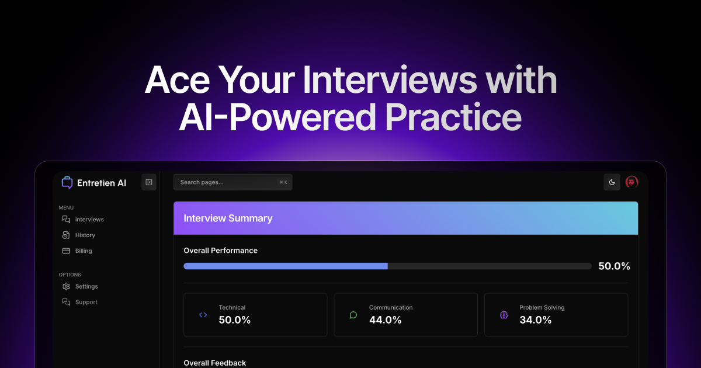

<p align="center" style="margin-top: 20px">
  <p align="center">
    Entretien AI - Master Your Interview Game
    <br>
    <a href="https://entretien-ai.com"><strong>Get Started »</strong></a>
    <br />
    <br />
    <a href="https://entretien-ai.com/about">About</a>
    ·
    <a href="https://entretien-ai.com">Website</a>
    ·
    <a href="https://entretien-ai.com/blog">Blog</a>
    ·
    <a href="https://entretien-ai.com/pricing">Pricing</a>
  </p>
</p>

## About Entretien AI

Master the art of interviewing with Entretien AI. Our cutting-edge platform uses advanced AI technology to provide personalized interview preparation, helping you transform interview anxiety into confident performance. Whether you're targeting tech giants or startups, we'll help you showcase your best self.

## Key Features

- **AI-Powered Mock Interviews**: Experience realistic interview simulations with our advanced AI system
- **Real-Time Feedback**: Get instant analysis on your responses, body language, and delivery
- **Technical Interview Prep**: Specialized tracks for software engineering roles across all levels
- **Performance Analytics**: Track your progress with detailed metrics and improvement insights
- **Custom Interview Paths**: Tailored preparation paths based on your target role and company
- **Comprehensive Feedback**: Detailed analysis of technical accuracy, communication skills, and presentation

## Tech Stack

<p align="left">
  <a href="https://nextjs.org"></a>
  <a href="https://react.dev"></a>
  <a href="https://www.typescriptlang.org"></a>
  <a href="https://tailwindcss.com"></a>
  <a href="https://www.prisma.io"></a>
</p>

### Frontend
- [Next.js 15](https://nextjs.org/) - React Framework
- [React 19](https://react.dev/) - UI Library
- [TypeScript](https://www.typescriptlang.org/) - Programming Language
- [Tailwind CSS](https://tailwindcss.com/) - Styling
- [shadcn/ui](https://ui.shadcn.com/) - UI Components

### Backend & Database
- [PostgreSQL](https://www.postgresql.org/) - Database
- [Prisma](https://www.prisma.io/) - ORM
- [Neon](https://neon.tech/) - Serverless Postgres
- [Auth.js v5](https://authjs.dev/) - Authentication
- [Server Actions](https://nextjs.org/docs/app/api-reference/functions/server-actions) - API Endpoints

### Email & Communications
- [Resend](https://resend.com/) - Email Infrastructure
- [React Email](https://react.email/) - Email Templates

### Payments
- [Stripe](https://stripe.com/) - Payment Processing

## Getting Started

### Prerequisites

- Deno, bun or node.js 18.x or higher
- PostgreSQL database
- Stripe account
- Resend API key
- Together.ai API key

### Installation

1. Clone the repository:

```sh
git clone https://github.com/rayenfassatoui/entretien-ai
```

2. Install dependencies:

```sh
bun install
```

3. Copy the example environment file:

```sh
cp .env.example .env
```

4. Set up your environment variables:
- NEXTAUTH_URL
- NEXTAUTH_SECRET
- NEXT_PUBLIC_APP_URL
- DATABASE_URL
- AI_API_KEY

5. Initialize the database:

```sh
bun prisma db push
```

6. Run the development server:

```sh
bun dev
```

## Contributing

We welcome contributions! Please see our contribution guidelines for details.

## Contact

For support or inquiries, contact us at support@entretien-ai.com

## Privacy & Security

We take your privacy seriously. See our [Privacy Policy](https://entretien-ai.com/privacy) for details about:
- Data collection and usage
- Security measures
- Your privacy rights

## License

Open Source but you can't sell it, but you can use it for free for non commercial use.

## Environment Variables in production

For production builds, the application uses `.env.production` with dummy values during build time. The actual runtime values are provided by Azure App Service environment variables.

Do not modify `.env.production` with real values as it's committed to the repository.


## the shader gradients
here's the links to the used gradients:

```

Gradient 1:
https://www.shadergradient.co/customize?animate=on&axesHelper=on&bgColor1=%23000000&bgColor2=%23000000&brightness=1&cAzimuthAngle=180&cDistance=5.7&cPolarAngle=115&cameraZoom=1&color1=%23268c9a&color2=%239224b3&color3=%23000000&destination=onCanvas&embedMode=off&envPreset=city&format=gif&fov=45&frameRate=10&grain=on&lightType=3d&pixelDensity=1&positionX=-0.5&positionY=0.1&positionZ=-1&range=enabled&rangeEnd=40&rangeStart=0&reflection=0.1&rotationX=0&rotationY=0&rotationZ=235&shader=defaults&toggleAxis=true&type=waterPlane&uAmplitude=0&uDensity=1.1&uFrequency=5.5&uSpeed=0.1&uStrength=2.4&uTime=0.2&wireframe=false&zoomOut=false

Gradient 2:
https://shadergradient-web.vercel.app/customize?animate=on&axesHelper=off&bgColor1=%23000000&bgColor2=%23000000&brightness=1.1&cAzimuthAngle=170&cDistance=4.4&cPolarAngle=70&cameraZoom=1&color1=%23b5e1ff&color2=%23f6d1ff&color3=%23ffffff&destination=onCanvas&embedMode=off&envPreset=city&format=gif&fov=45&frameRate=10&gizmoHelper=hide&grain=on&lightType=3d&pixelDensity=1&positionX=0&positionY=0.9&positionZ=-0.3&range=enabled&rangeEnd=40&rangeStart=0&reflection=0.1&rotationX=45&rotationY=0&rotationZ=0&shader=defaults&type=waterPlane&uAmplitude=0&uDensity=1.2&uFrequency=0&uSpeed=0.1&uStrength=3.4&uTime=0&wireframe=false

```
